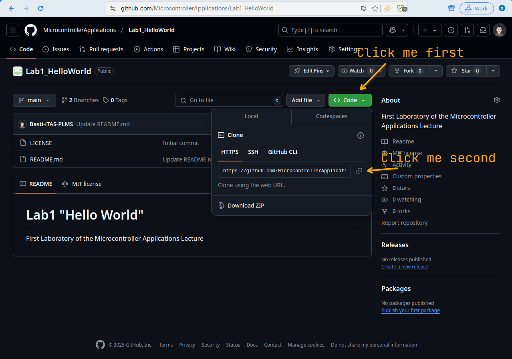
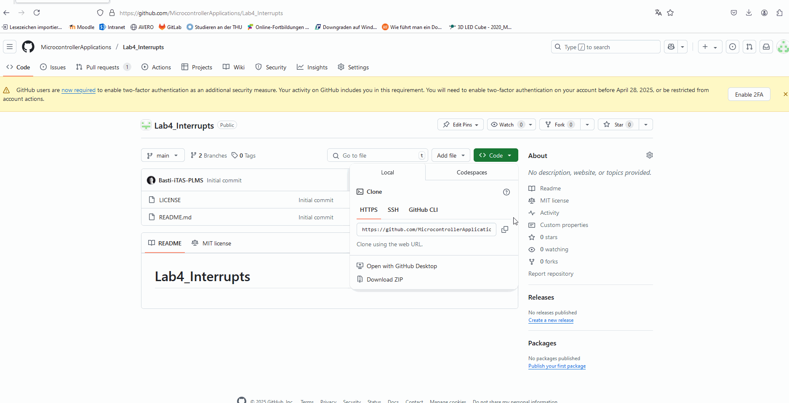
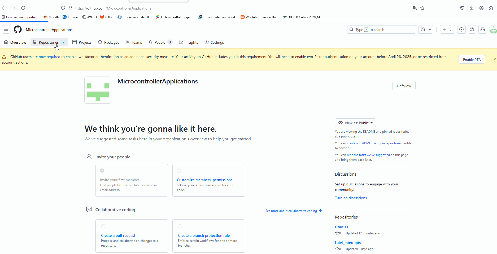

# Git
Git is nowadays probably the most common Version Control System for Software Development. Version Control is used to create a change history during development. 
This reduces the potential of data loss and enables one to easily reset changes. Furthermore, in professional software development teams Version Control can be used to review the work of colleagues to improve code quality and reduce the potential for bugs.

Within this lecture we will not actively use Git, but provide you with the corresponding code for your lab sessions via GitHub.
Therefore, mainly one feature of Git is necessary - cloning a repository, which will be explained within this manual.
Those who want to know more about Git, should take a look at the [References](#references)

## Git Clone
If not stated otherwise within the repositories README, cloning a git repository is always the same and requires the below two steps.
### 1. Get the repository's link (in our case from GitHub)
---
Links to the relevant repositories are provided via Moodle for each laboratory session. 

### 2. Open MPLAB X IDE and clone the current repository
---
Before you start, make sure that all your old projects are closed. To do so, you need to right-click on the microcontroller symbol of your current project shown in the left-hand column and then select *close*.
To clone the repository please the below instructions:

For those who do like to have written instructions:
1. copy the repository link (see ### 1.)
2. open MPLAB X IDE
3. close all open projects
4. choose in the toolbar TEAM
5. choose GIT --> clone
6. enter the repository link and choose the Destination Folder *U:/Microcontroller*, click Next
7. select main as your remote Branch, click Next
8. check your settings and select finish

### 3. Clone the Library, you only need to do this once :)
> [!WARNING]
> In case you already cloned the library into your working folder - **do not clone it a second time!** unless you change your working folder ;)

For those who do like to have written instructions: 
1. Open the [GitHub repository _C_LIB](https://github.com/MicrocontrollerApplications/_C_Lib)
2. Copy the repository link (see ### 1.)
3. follow step 2. to 8. of the in ### 2. described instructions

If you want your repositories to be stored in a different folder simply change the location from *U:/Microcontroller/* to your preferred location. But keep in mind that it's harder to support you in case you use a different setup and that **you need to make sure that _C_LIB is always positioned correctly!**

## References
1. [Medium - An Introduction to Git for Beginners](https://medium.com/chaya-thilakumara/an-introduction-to-git-for-beginners-c97e701cecf9)
1. [Oh My Git - An open source game about learning Git!](https://ohmygit.org/)
1. [Git Documentation](https://git-scm.com/doc) (This is really for advanced Git users)
